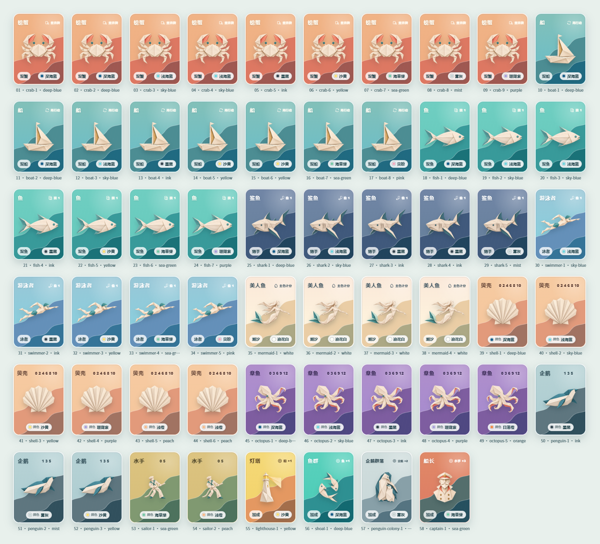

# SEA SALT & PAPER · 非官方单机网页版

一款面向中文玩家的《SEA SALT & PAPER》基础规则单机网页改编。保留抽牌、Duo 组合、STOP、最后机会、多轮计分等核心体验，并以重新绘制的简约折纸卡面呈现完整 58 张基础牌。

> 在线体验：[https://mypapersalt.pages.dev](https://mypapersalt.pages.dev)


## 项目亮点

- 支持 2–4 人对局：1 名真人与 1–3 名 AI。
- 包含简单、中等、困难三档 AI 难度。
- 实现抽二留一、双弃牌堆、四种 Duo、STOP 与最后机会。
- 支持螃蟹、船、鱼、鲨鱼＋游泳者等组合效果。
- 实现贝壳、章鱼、企鹅、水手、美人鱼及加成牌计分。
- 使用完整 58 张基础牌，并校验牌型数量与颜色总量。
- 响应式桌面与手机布局，牌面清晰、操作区域不重叠。
- 提供轻量、清爽的选牌和出牌音效。
- 无需注册、无需后端，打开网页即可游玩。

## 58 张卡牌

卡牌主体采用重新绘制的几何折纸图案；牌名、效果、累计分值、类别和颜色集中呈现在同一套视觉系统中。



## 开始游玩

直接访问：**[mypapersalt.pages.dev](https://mypapersalt.pages.dev)**

推荐使用最新版 Chrome、Edge、Firefox 或 Safari。首次打开后，在首页选择玩家人数和 AI 难度即可开始。

## 本地运行

需要 Node.js 18 或更高版本。

```bash
npm install
npm run dev
```

浏览器打开终端显示的本地地址，默认通常为 `http://127.0.0.1:5173/`。

## 测试与构建

```bash
# 运行规则与 AI 测试
npm run test

# 类型检查并生成生产版本
npm run build

# 完整验证
npm run verify
```

生产文件会生成到 `dist/`，可部署到 Cloudflare Pages、GitHub Pages 或其他静态托管平台。

## 项目结构

```text
src/
├─ components/       卡牌、效果标记等界面组件
├─ core/             牌库数据、规则引擎、计分与 AI
├─ assets/audio/     选牌与出牌音效
├─ App.vue           游戏主界面
└─ styles.css        全局视觉与响应式布局

public/card-art-v2/  透明背景的折纸主题素材
docs/images/         README 展示图片
```

## 规则与数据说明

牌型数量、颜色总量、回合流程和结算规则依据 Bombyx 发布的《SEA SALT & PAPER》英文基础版规则书整理，不包含扩展规则。

逐张“牌型—颜色”关系集中维护在 `src/core/cards.ts`；规则引擎、计分和 AI 测试位于 `src/core/__tests__/`，便于继续复核和迭代。

## 技术栈

- Vue 3
- TypeScript
- Vite
- Vitest
- Cloudflare Pages

## 在线地址

- 游戏网站：[https://mypapersalt.pages.dev](https://mypapersalt.pages.dev)
- GitHub 仓库：[https://github.com/czm-mmm/mypapersalt](https://github.com/czm-mmm/mypapersalt)

## 权利声明

本项目是非官方、非商业的学习与交互原型，与 Bombyx、游戏设计师或原作美术作者无隶属关系。

SEA SALT & PAPER 名称、原作规则呈现、折纸作品、照片、商标及相关素材权利归各自权利人所有。项目不包含原版卡牌扫描图、照片或官方 Logo，请支持正版桌游。
